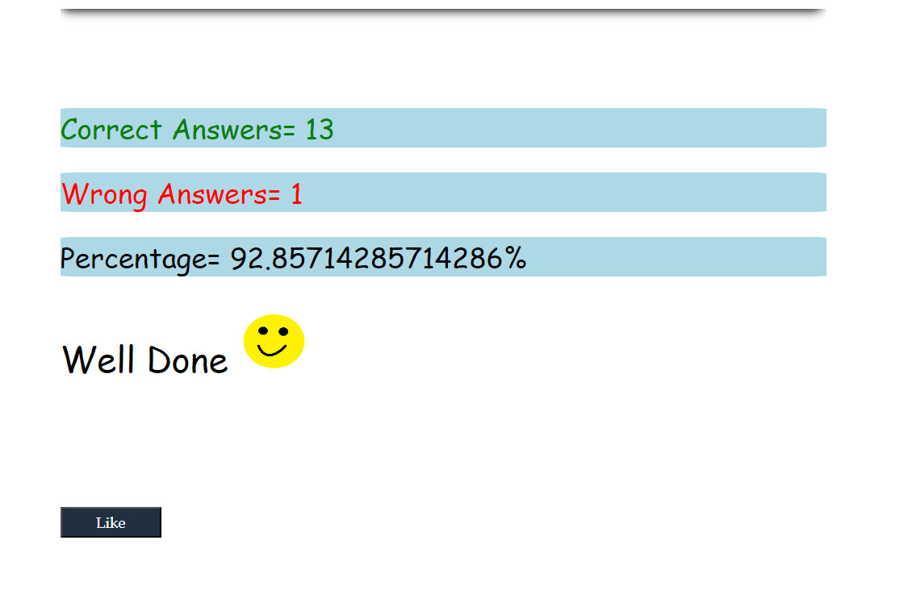

# 1. What are the variable naming conventions in JavaScript?
# Ans.Variable names are case-sensitive. ...
# *Subsequent characters may be letters, digits, dollar signs, or underscore characters
# *If the name you choose consists of only one word, 
# 2. Create a greeting alert (use => prompt, message, alert)
# Ans.  let yourName=prompt("Enter your name")
## alert("Hello" + " " +yourName +"!"+" " + "Welcome" + " "+"to"+" "+ "our"+" "+ "website.")
# 3.Write some code so that the values of the below variables switch around 
# Let fish = “fly”, let bird = “swim”. Switch the value so that fish holds the value “swim” and the variable bird holds the value “fly”
```js
let fish=fly;
let bird=swim;
let c=bird
bird=fish
fish=c
console.log("fish="+fish)
console.log("bird="+bird)
```

